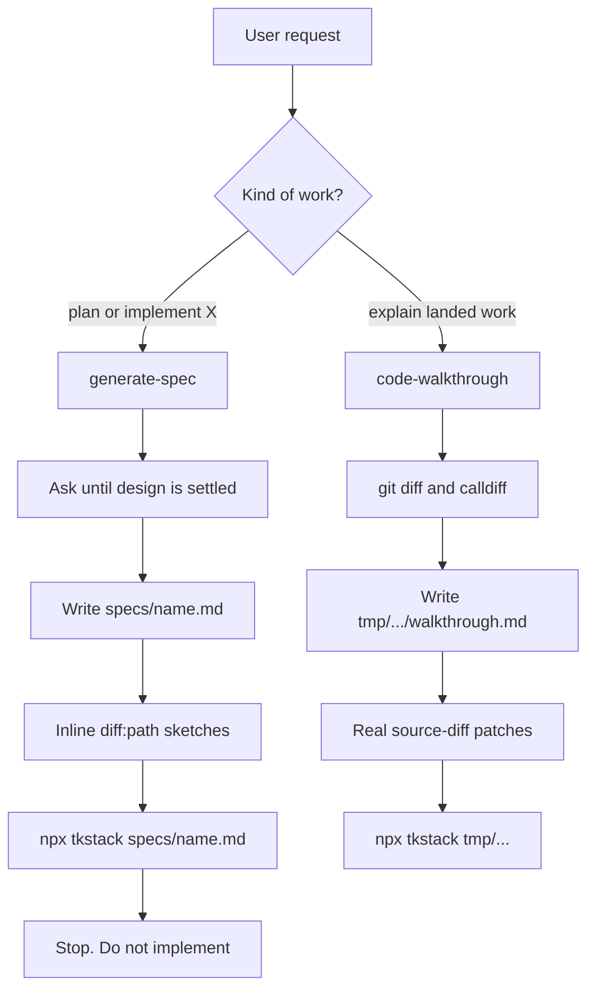
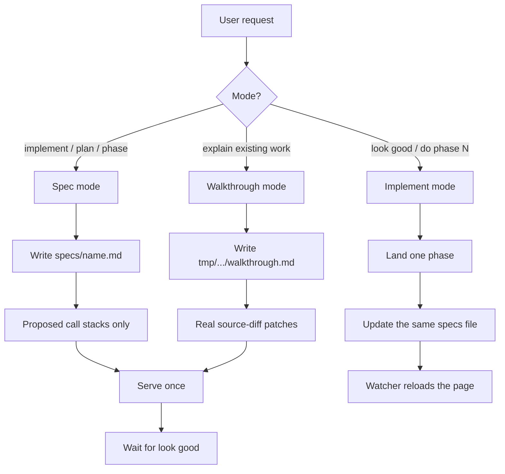
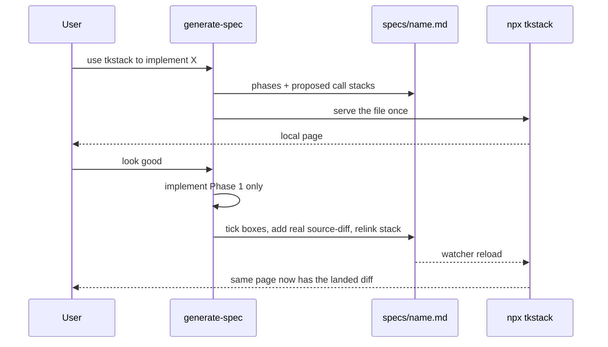
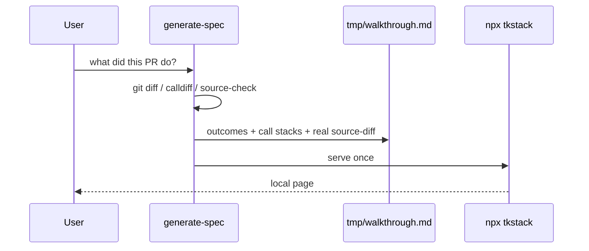

# Merge generate-spec and code-walkthrough

## System flow

One skill, three jobs: spec a piece, implement it phase by phase in the same document, or explain work that already landed. The viewer does not change in the first four phases. `npx tkstack` already reloads when that one markdown file changes.

### Current: two opposite skills



Spec skill forbids implementing. Walkthrough skill forbids planning. There is no “look good, now do Phase 1” path, and diffs never appear on the spec page.

### Target: one skill, same document



Walkthrough stays a mode, not a second skill. Implement-from-spec always lives at `specs/<name>.md`. Explain-only still goes under `tmp/`.

### Spec then implement in one chat



The viewer does not read git. “Diffs show up automatically” means the agent edited the spec and the page refreshed.

### Explain-only walkthrough



No implementation checklist. No `specs/` file.

## Problem overview

`generate-spec` and `code-walkthrough` are written as opposites. One must not implement; the other must not plan. Specs go in `specs/` with invented `diff:path` sketches. Landed explanations go in a new `tmp/` file with real `source-diff` patches. Asking the agent to spec, then implement, cannot update the page you are already reading. Spec mode also interviews until the design is settled, so there is often no page until Q&A finishes.

## Solution overview

Fold both jobs into `skills/generate-spec` until there is an npm-available product name that is not `tkstack`. The skill has three modes chosen from the user request: spec, implement, walkthrough. Spec mode writes phases and proposed call stacks, serves the file, and waits. Implement mode continues in the same chat after “look good”: one phase, then the same markdown gets real `source-diff` patches and relinked stacks. Walkthrough-only keeps today’s research rules and `tmp/` path. Keep `code-walkthrough` as the same three-mode skill under a second install name so existing installs still resolve. Viewer polish (auto-open Diff, live title, parse error page) is a later optional phase.

## Goals

- Installing one skill is enough to spec, implement phase by phase, and explain landed work.
- Implement-from-spec is always `specs/<name>.md`. That file is the whole record.
- Spec-time documents have proposed call stacks only: no `source-diff` and no inline `diff:path` sketches.
- After a phase lands, that same file ticks the phase, embeds a real git patch, and points stack rows at it.
- Walkthrough-only (“explain this PR”) still works, still under `tmp/`, still with real diffs and no fake checklist.
- Serve once per file. If `npx tkstack list` already shows that file, do not start a second server on 4177.
- README advertises a single `npx skills add tanishqkancharla/tkstack --skill generate-spec`.

## Non-goals

- Renaming the skill or npm package to `tkstack`.
- Viewer reading git itself, or generating patches from the working tree.
- Multi-file / directory viewer, auth, hosting, or anything other than local `npx tkstack`.
- Changing Maui TOC or Diff layout beyond auto-open, title refresh, and a parse error page.
- Deleting the `code-walkthrough` install name in this work (it becomes an alias of the merged skill).
- Implementing this merge before the user says look good.

## Important files, docs, and websites

- [`skills/generate-spec/SKILL.md`](../skills/generate-spec/SKILL.md) — Canonical skill. Today: research, Q&A until settled, `specs/<name>.md` with `diff:path` sketches, serve, do not implement.
- [`skills/code-walkthrough/SKILL.md`](../skills/code-walkthrough/SKILL.md) — Opposite skill. Today: landed-only research, `tmp/code-walkthrough-<name>/walkthrough.md`, real `source-diff`, do not plan.
- [`skills/generate-spec/agents/openai.yaml`](../skills/generate-spec/agents/openai.yaml) — Default prompt is “plan this feature as a phased implementation spec.”
- [`skills/code-walkthrough/agents/openai.yaml`](../skills/code-walkthrough/agents/openai.yaml) — Default prompt is explain already-made changes.
- [`README.md`](../README.md) — Two install lines; viewer does not own spec vs walkthrough section order.
- [`src/cli.ts`](../src/cli.ts) — `npx tkstack <file>` and `npx tkstack list`.
- [`src/serve.ts`](../src/serve.ts) — `startServer`: Vite, `strictPort`, 24h idle, `/__tkstack/meta` title captured at start.
- [`src/contentPlugin.ts`](../src/contentPlugin.ts) — Watches the markdown file and `reloadModule`s `virtual:tkstack`. `parseViewerDocument` errors throw and Vite fails the page.
- [`src/parseViewer.ts`](../src/parseViewer.ts) — Invalid `source-diff` is a parse error for the whole document.
- [`src/viewer/ViewerApp.tsx`](../src/viewer/ViewerApp.tsx) — Diff panel exists only when there are source diffs or references; starts closed.
- [`src/registry.ts`](../src/registry.ts) — Running-viewer list used to avoid a second server.
- [TK Stack README — source links](https://github.com/tanishqkancharla/tkstack#link-call-stacks-to-source-changes) — `[[path#symbol]]` and `source-diff` syntax the skill must keep teaching.

## Implementation

### Phase 1: Merge the skill text

One `SKILL.md` with three modes. Description must match spec, implement, and explain-landed. Delete the “counter-equivalent / do not implement / do not plan” bans. Keep the install name `generate-spec`. Copy the same body into `skills/code-walkthrough` with `name: code-walkthrough` so either install still loads the merged skill.

```callstack
 agent
-├── generate-spec [[skills/generate-spec/SKILL.md]]
-│   ├── research then Q&A until settled
-│   ├── write specs/<name>.md  # includes diff:path sketches
-│   └── npx tkstack  # always start
-└── code-walkthrough [[skills/code-walkthrough/SKILL.md]]
-    ├── research landed change
-    ├── write tmp/code-walkthrough-<name>/walkthrough.md
-    └── npx tkstack  # always start
+└── generate-spec [[skills/generate-spec/SKILL.md]]  # three modes; code-walkthrough is the same body
     ├── spec → specs/<name>.md, proposed stacks only, wait
     ├── implement → same file, one phase, real source-diff after land
     └── walkthrough → tmp/code-walkthrough-<name>/walkthrough.md
         └── serveOnce [[src/cli.ts]]  # listRunningTkstacks; skip if that file is already up
             └── listRunningTkstacks [[src/registry.ts#listRunningTkstacks]]
```

Trigger lines at the top of the skill:

- **Spec:** user wants to implement, plan, spec, scope, or phase work.
- **Implement:** user approved (“look good”) or “do phase N”. Same chat; no second install.
- **Walkthrough:** user wants an explanation of existing or uncommitted work and there is no implement-from-spec file for it.

File rule: implement-from-spec always `specs/<short-kebab-case-name>.md`. Walkthrough-only: `tmp/code-walkthrough-<name>/walkthrough.md`. Do not open a second walkthrough under `tmp/` for work that started as this spec.

Serve once. Before `npx tkstack <file>`, run `npx tkstack list`. If that absolute file is already served, reuse its URL. Do not start a second server on 4177 (`strictPort` fails). Leave the process running; do not kill it.

README: one install command. `openai.yaml` default prompt: “use tkstack to spec this, then implement phase by phase in the same doc.” The code-walkthrough yaml can keep a walkthrough-flavored prompt that still names the merged skill.

- [ ] Rewrite [`skills/generate-spec/SKILL.md`](../skills/generate-spec/SKILL.md): frontmatter description covers spec, implement, and explain-landed; three-mode triggers; delete opposite-skill bans; file rules; serve-once via `npx tkstack list`.
- [ ] Mirror the same body in [`skills/code-walkthrough/SKILL.md`](../skills/code-walkthrough/SKILL.md) with `name: code-walkthrough`.
- [ ] Update [`skills/generate-spec/agents/openai.yaml`](../skills/generate-spec/agents/openai.yaml) default prompt to spec-then-implement in the same doc.
- [ ] Point [`skills/code-walkthrough/agents/openai.yaml`](../skills/code-walkthrough/agents/openai.yaml) at the merged skill.
- [ ] README: single `npx skills add tanishqkancharla/tkstack --skill generate-spec`. One paragraph for the three modes. Stop listing two opposite skills.
- [ ] Run `npm run format:check`. No product TypeScript in this phase.

### Phase 2: Spec mode (write-then-review)

Replace “interview until settled, then write” with “research current paths, write the page, ask only if the answer would change the phases.” The existing section shape stays: System flow, Problem / Solution / Goals / Non-goals / Sources, Implementation / Phase N.

```callstack
 generate-spec [[skills/generate-spec/SKILL.md]]
-├── ask one question at a time until design is settled
-├── writeSpec
-│   ├── callstack  # proposed path
-│   └── diff:path  # inline sketches of unwritten code
-└── startServer [[src/serve.ts#startServer]]
+├── research current call paths
+├── ask only if the answer would change the phases
+├── writeSpec  # specs/<name>.md
+│   └── callstack  # proposed path only; proposed-only symbols unlinked
+└── serveOnce [[src/cli.ts]]
     └── startServer [[src/serve.ts#startServer]]  # skipped when list already has this file
```

Spec-time artifacts:

- Proposed `callstack` fences (current path with `-`, proposed path with `+`).
- Mermaid current vs new, with `%% ref` only to code that exists now.
- Phase checklists with files, symbols, and commands where known.

Forbidden at spec time:

- `source-diff:id:path` (invented patches parse-error the whole page).
- Inline `diff:path` sketches (they stay in the article and do not fill the Diff panel; they are not the product).
- Implementing any phase.

After serving, tell the user the spec path and local URL. Stop and wait for “look good.” Do not open the URL unless asked.

Drop `diff:path` from the skill’s format template and fence-reference table as a spec-time tool. Keep it in the README as a viewer fence; specs just must not use it.

- [ ] Spec-mode section: research, write, serve, wait. Q&A only when it would change phases.
- [ ] Format template: phases + proposed call stacks. Remove the `diff:path` example and the “show short code previews” rule.
- [ ] Fence reference: spec-time uses `mermaid`, `callstack`, checklists. `source-diff` is documented as after-land only.
- [ ] Final check for spec mode: no `source-diff`, no `diff:path`, server up, path + URL reported.
- [ ] Run `npm run format:check`.

### Phase 3: Implement mode (same doc updates)

This is the product. After approval, do **one** phase. Update **that same file** in the same turn, then leave `npx tkstack` running so HMR shows the landed diff.

```callstack
 generate-spec [[skills/generate-spec/SKILL.md]]
-└── stop after serving  # do not implement
+└── onLookGood  # or "do phase N"
     ├── implement exactly one phase
     ├── run that phase's focused check
     ├── gitDiff  # only the files this phase named
     ├── updateSameSpec
     │   ├── tick checkboxes that are actually done
     │   ├── add source-diff:id:path  # real patch with diff --git / hunk headers
     │   └── relink callstack  # [[path#symbol]] and [[id:new:…]]
     └── leaveRunning
         └── tkstackContentPlugin [[src/contentPlugin.ts#tkstackContentPlugin]]
             └── reloadModule  # page already open; do not start a second server
```

After-land rules for the phase that just shipped:

1. Tick only the checklist items that are actually done.
2. Paste a real `git diff` into `source-diff:id:path`. Include `diff --git`, `---`, `+++`, and `@@` headers. For untracked files, `git diff --no-index -- /dev/null <path>` (exit 1 means differences).
3. Update that phase’s call stack to the landed path. Link symbols with `[[path#symbol]]`. Point changed rows at the new diffs with `[[id:new:start-end]]` (and `old` for removals).
4. Leave later phases as still-proposed call stacks with no `source-diff`.
5. If a patch would be invalid (`parseViewerDocument` would throw), **omit** `source-diff` and say so in prose. Do not crash the page.
6. Do not write `tmp/code-walkthrough-*` for work that started as this spec.
7. After the last phase, the spec **is** the walkthrough. Problem / Solution may shift to past tense.

Header title is captured at server start. Changing the H1 later will not refresh the chrome until Phase 5; do not rename the H1 mid-flight unless the user is told to restart.

- [ ] Implement-mode section: one phase per turn; same file; tick / `source-diff` / relink / leave later phases proposed.
- [ ] Invalid-patch rule: omit `source-diff`, explain in prose, keep the page alive.
- [ ] Keep-alive: `npx tkstack list` before serve; never a second server; never kill the running viewer.
- [ ] Ban opening `tmp/` walkthroughs for implement-from-spec work.
- [ ] Run `npm run format:check`.

### Phase 4: Walkthrough-only mode

Copy the current walkthrough research rules into the merged skill. Same fences as a finished spec (`source-diff` + call stacks). No fake Implementation checklist.

```callstack
 agent
-└── code-walkthrough [[skills/code-walkthrough/SKILL.md]]
-    ├── collectChange  # git diff, git log, PR range
-    ├── calldiff
-    ├── sourceCheck
-    ├── write tmp/code-walkthrough-<name>/walkthrough.md
-    └── startServer [[src/serve.ts#startServer]]
+└── generate-spec  # walkthrough mode [[skills/generate-spec/SKILL.md]]
     ├── collectChange  # git diff, git log, PR range
     ├── calldiff
     ├── sourceCheck  # interfaces, callbacks, events
     ├── write tmp/code-walkthrough-<name>/walkthrough.md
     │   ├── Problem / Solution / User flows / outcome chapters
     │   ├── callstack  # landed path, no invented calls
     │   └── source-diff  # real patches only
     └── serveOnce [[src/cli.ts]]
```

Choose walkthrough mode when the user wants an explanation of existing or uncommitted work and there is no `specs/<name>.md` already being implemented. If they point at a spec in progress, that is implement mode, not a new tmp file.

Keep: comparison range in the title area; past-tense Solution; outcome headings without `Chapter:`; no standalone source excerpts unless asked; verification claims match checks actually run.

- [ ] Walkthrough-mode section: current research rules (`git diff`, calldiff, source-checked stacks) and `tmp/` path.
- [ ] Template: Problem / Solution / User flows / `## <outcome>` chapters. No Implementation checklist.
- [ ] Mode picker: explain-landed without a spec → `tmp/`. Spec already in `specs/` → update that file instead.
- [ ] Keep both skill folders in sync after this section lands.
- [ ] Run `npm run format:check`.

### Phase 5: Small viewer polish

Optional. Only this phase changes product TypeScript. Skill-only work in Phases 1–4 already produces diffs via HMR; this phase makes that feel automatic and fail safe.

```callstack
 startServer [[src/serve.ts#startServer]]
 ├── extractTitle [[src/extractDocument.ts#extractTitle]]  # today: once at boot
 ├── tkstackContentPlugin [[src/contentPlugin.ts#tkstackContentPlugin]]
 │   ├── load
 │   │   └── parseViewerDocument [[src/parseViewer.ts#parseViewerDocument]]
-│   │       └── throw  # Vite overlay / blank page on bad source-diff
+│   │       └── on error: export parseError  # ViewerApp error page, not throw
 │   └── watcher.change → reloadModule
 └── handleTkstackRequest [[src/serve.ts]]
     └── GET /__tkstack/meta
-        └── captured title
+        └── extractTitle  # re-read the markdown file
             └── ViewerApp [[src/viewer/ViewerApp.tsx#ViewerApp]]
-                └── showDiffPanel = false  # until Diff or a linked row
+                ├── title from meta after each reload
+                └── open Diff when sourceDiffs becomes non-empty after reload
```

Behavior:

- Re-read the H1 on `/__tkstack/meta` (and refetch from `ViewerApp` when `virtual:tkstack` reloads) so renaming the heading updates the chrome without restart.
- Auto-open the Diff panel when the first real `source-diff` appears after a reload. Symbol-only `[[path#symbol]]` references must not auto-open; spec-time pages stay single-panel until a patch exists.
- If `parseViewerDocument` returns `TkstackParseError` or `TkstackAnnotationError`, `tkstackContentPlugin` must not throw. Show an error page with the message. The article watcher should still recover on the next valid save.
- **Not in this phase:** generating patches from the working tree.

- [ ] `/__tkstack/meta` re-reads the file through `extractTitle`. `ViewerApp` refreshes the header on HMR.
- [ ] Auto-open Diff iff `viewerDocument.sourceDiffs.length > 0` after reload; keep closed for references-only docs.
- [ ] `tkstackContentPlugin.load` exports a parse error instead of throwing; `ViewerApp` renders that error.
- [ ] Run `npm run typecheck` and `npm run lint`.
- [ ] Manual: serve a spec, add a valid `source-diff`, confirm Diff opens; break the patch, confirm an error page; fix it, confirm the page returns.

### Phase 6: Verify the merged flow

No new product. Confirm the skill and viewer behave as one flow.

```callstack
 verify
 ├── fixtureTwoPhases
 │   ├── Phase 1 landed  # source-diff + stack rows [[id:new:…]] + checked boxes
 │   └── Phase 2 proposed  # call stack only, open boxes, no source-diff
 ├── ViewerApp [[src/viewer/ViewerApp.tsx#ViewerApp]]
 │   ├── TableOfContents [[src/viewer/TableOfContents.tsx#TableOfContents]]  # both phases nested
 │   └── SourceDiffPanel  # only the landed patch
 └── manualDogfood
     ├── npx skills add tanishqkancharla/tkstack --skill generate-spec
     ├── spec a tiny change
     ├── look good → implement phase 1
     └── open viewer hot-reloads with the patch
```

Add a fixture (for example `fixtures/spec-then-implement.md`) with two Implementation phases in that mixed state. Confirm old skill names still resolve via the alias folder, and README no longer teaches two opposite skills.

- [ ] Add a two-phase fixture: one landed (`source-diff` + linked stack + checked boxes), one proposed (call stack only).
- [ ] Serve the fixture: TOC nests both phases; Diff panel lists only the landed patch; Phase 2 has no `source-diff`.
- [ ] Scratch-repo manual: install `generate-spec` only, spec a tiny change, approve, implement phase 1, confirm the open viewer reloads and the patch appears.
- [ ] Confirm `code-walkthrough` still installs and describes walkthrough mode; README install line is only `generate-spec`.
- [ ] Run `npm run typecheck` and `npm run lint` if Phase 5 landed; otherwise `npm run format:check`.
